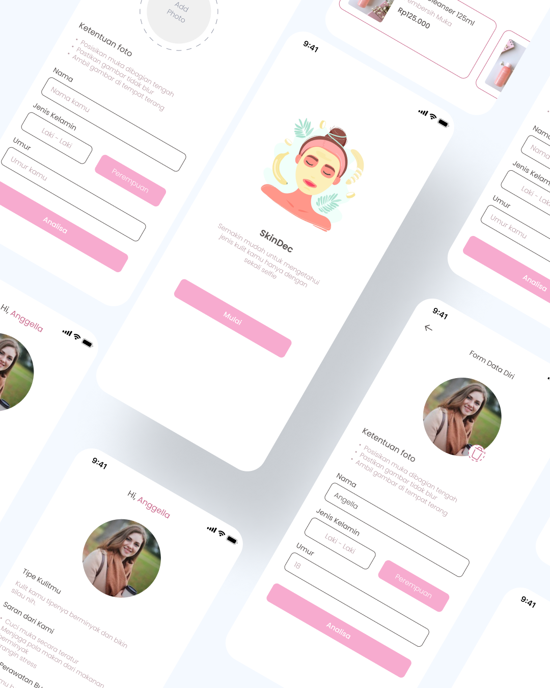
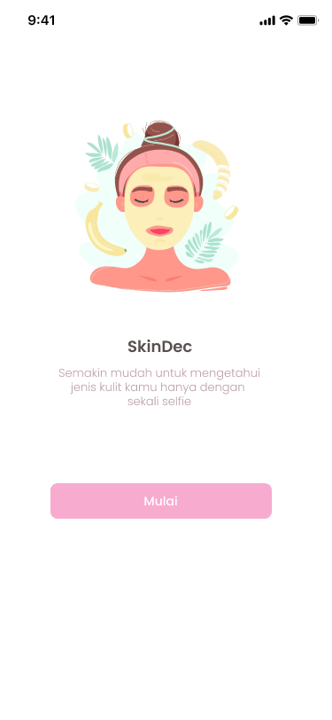
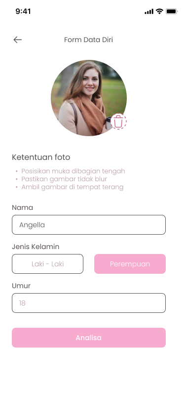
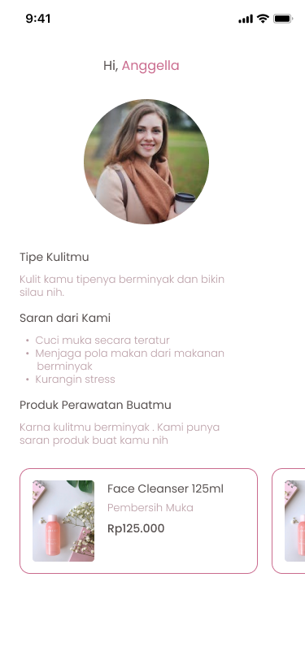

<h1 align="center">
    SkinDec  
</h1>
<h5 align="center">
    Mobile Development B21-CAP0215 Capstone Project | Healthcare
</h5>

  
  
  

  

## Table of Contents
- [Introduction](#introduction)
- [Technology](#technology)
- [Design Application](#design-application)

## Introduction

    This project was created to fulfill the final capstone assignment held by Bangkit 2021.

    SkinDec is a health service that can help you find out your skin type, such as acne, oily, dry, or normal.
    
    Take a selfie with your smartphone and you will receive the skin type classification result in less than 60 seconds. We also provide recommendations
    on how to reduce these skin problems, including recommendations for suitable products according to skin type.

## Technology
We combine technologies including Machine Learning, Cloud Computing, and Mobile Development.

<h3>Machine Learning</h3>

    We started looking for datasets according to the labels defined by our team and then built a Machine Learning model with TensorFlow and Keras Neural Network from scratch,
    applying Image Augmentation to our image datasets to expand our dataset so that there is no overwriting and our model generalizes well. Then we tried to optimize our TF model by dropping  
    some layers and using Transfer Learning which can drastically improve the accuracy of our model. For deployment, we use TF Serve on our cloud servers.

<h6>&emsp;Library and Framework :</h6>

- [TensorFlow: 2.5.0](https://www.tensorflow.org/api_docs)
- [NumPy: 1.20.3](https://numpy.org/doc/)
- [Keras: 2.4.3](https://keras.io/)

<h3>Cloud Computing</h3>

    Develop API with python programming languange that utilize flask framework and SQLAlchemy extension library to facilitate the comunication between python programs
    and databases and to comunicate with Machine Learning model server.
    
    We release,manage, and maintain all backend services in the Google Cloud Platform. We deploy our database with SQL Cloud for MYSQL solution, Deploy Machine Learning model
    using TF Serve implementation on Compute Engine solution, Deploy database API on App Engine standard environment, and deploy prediction machine learning model API on Compute Engine solution.

<h6>&emsp;Library and Framework :</h6>

- [Flask: 1.1.2](https://flask.palletsprojects.com/en/2.0.x/)
- [SQLAlchemy: 2.4.3](https://www.sqlalchemy.org/)
- [Flask Marshmallow: 0.14.0](https://flask-marshmallow.readthedocs.io/en/latest/)
- [NumPy: 1.20.3](https://numpy.org/doc/)
- [Keras: 2.4.3](https://keras.io/)

<h3>Mobile Development</h3>

    We implement the design from figma into the android studio xml file, in the form of 3 pages, namely: the onboarding page, the data upload page, then the analysis
    results page which is the classification result.

    We implement an API to perform data transactions starting from sending personal data along with uploading a face image to the server, then getting the skin type
    classification results. As well as recommending suggestions for beauty products that are suitable for that skin type using retrofit and okhttp3.

<h6>&emsp;Library and Framework :</h6>

- [Retrofit: 2.9.0](https://github.com/square/retrofit)
- [Okhttp3: 3.11.0](https://github.com/square/okhttp)
- [ImagePicker: 2.0](https://github.com/Dhaval2404/ImagePicker)
- [Glide: 4.12.0](https://bumptech.github.io/glide/)

## Design Application

<h6>
    We are create design and prototyping with <a href="https://www.figma.com/file/Wk2PXze9Cfi4UJfam2ZsCw/SkinDec?node-id=110%3A124">Figma</a>
</h6>

| OnBoarding                 | Home Upload          | Result                 |
|:---------------------------:|:---------------------:|:-----------------------:|
|  |  |  |
